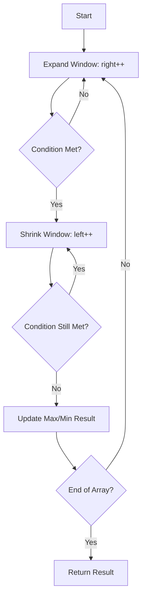

# DSA Patterns in Python (Placement 2027)


A professional collection of Data Structures and Algorithms patterns implemented in Python, following the **Striver A2Z Roadmap**. This repository is designed for interview readiness, emphasizing type-safety, comprehensive testing, and clean code.

<!-- DASHBOARD_START -->
## 📊 Progress Dashboard

**Total Problems Solved:** `43`

- **Step 1: Basics**: `9` solved
- **Step 2: Sorting**: `5` solved
- **Step 3: Arrays**: `12` solved
- **Step 4: Binary Search**: `1` solved
- **Step 5: Strings**: `0` solved
- **Step 6: Linked List**: `1` solved
- **Step 7: Recursion (Adv)**: `0` solved
- **Step 8: Bit Manipulation**: `1` solved
- **Step 9: Stack & Queue**: `1` solved
- **Step 10: Sliding Window & Two Pointers**: `2` solved
- **Step 11: Heaps**: `1` solved
- **Step 12: Greedy**: `1` solved
- **Step 13: Trees**: `1` solved
- **Step 14: BST**: `0` solved
- **Step 15: Graphs**: `1` solved
- **Step 16: Dynamic Programming**: `2` solved
- **Step 17: Trie**: `1` solved

<!-- DASHBOARD_END -->

## 💡 Why this Repo?
Most DSA repositories are just a collection of solutions. This repo focus on **Patterns**.
- **Mental Models**: Each category includes notes on *how* to identify the pattern.
- **Placement-Centric**: Problems are selected from the Striver A2Z sheet, a gold standard for MAANG prep.
- **Production-Grade**: We treat DSA like real software—with tests, types, and CI.

## 🧠 Pattern Visualization
Here's how a typical **Sliding Window** pattern flow looks:



## 🚀 Key Features
- **Type-Safe**: Fully annotated with `mypy` for strict type-checking.
- **Tested**: Comprehensive unit tests using `pytest`.
- **Linted**: Clean code enforcement using `ruff`.
- **Roadmap Aligned**: Structured exactly according to the Striver A2Z progression.
- **Automation**: Custom scripts for scaffolding and progress tracking.

## 🛠️ Stack & Setup
- **Logic**: Python 3.11+
- **Testing**: `pytest`
- **Linting/Formatting**: `ruff`
- **Type Checking**: `mypy`
- **CI/CD**: GitHub Actions

```bash
pip install -r requirements.txt
python -m ruff check .
python -m mypy .
python -m pytest
```

## 🏗️ Project Architecture
The repository is designed with a **Separation of Concerns** (SoC) principle:
- **Patterns Layer**: Organized by algorithmic logic (Arrays, DP, Graphs).
- **Quality Layer**: Decoupled tests in `tests/` ensuring 100% logic coverage.
- **Automation Layer**: Custom Python tooling in `scripts/` for scaffolding and dynamic progress reporting.
- **Traceability Layer**: `problem_tracker.csv` acts as a single source of truth for problem metadata.

## 🛠️ Developer Experience (DX)
We treat this DSA practice as a real production codebase:
- **Scaffolding**: `create_problem.py` ensures all new problems follow the same standard.
- **Auto-Sync**: `generate_readme.py` automatically updates the dashboard below based on file discovery.
- **Consistency**: Enforcement of `ruff` and `mypy` in CI/CD via GitHub Actions.

<!-- SNAPSHOT_START -->
## 📂 Solved Problems Snapshot

- **`arrays/`**: `check_sorted.py`, `largest_element.py`, `left_rotate_by_d.py`, `left_rotate_by_one.py`, `linear_search.py`, `max_consecutive_ones.py`, `missing_number.py`, `move_zeroes.py`, `remove_duplicates.py`, `second_largest.py`, `two_sum.py`, `union_of_sorted_arrays.py`
- **`backtracking/`**: `subsets.py`
- **`basics/`**: `count_digits.py`, `reverse_number.py`
- **`binary_search/`**: `binary_search.py`
- **`bit_manipulation/`**: `single_number.py`
- **`dynamic_programming/`**: `climbing_stairs.py`, `zero_one_knapsack.py`
- **`graphs/`**: `number_of_islands.py`
- **`greedy/`**: `jump_game.py`
- **`hashing/`**: `valid_anagram.py`
- **`heap/`**: `kth_largest_element.py`
- **`intervals/`**: `merge_intervals.py`
- **`linked_list/`**: `reverse_linked_list.py`
- **`math/`**: `armstrong_number.py`, `check_prime.py`, `gcd_or_hcf.py`, `palindrome_number.py`, `print_divisors.py`
- **`math_geometry/`**: `rotate_image.py`
- **`recursion/`**: `factorial.py`, `fibonacci.py`
- **`sliding_window/`**: `best_time_to_buy_sell_stock.py`
- **`sorting/`**: `bubble_sort.py`, `insertion_sort.py`, `merge_sort.py`, `quick_sort.py`, `selection_sort.py`
- **`stack/`**: `valid_parentheses.py`
- **`trees/`**: `maximum_depth_binary_tree.py`
- **`trie/`**: `implement_trie.py`
- **`two_pointers/`**: `valid_palindrome.py`

<!-- SNAPSHOT_END -->

## 📜 Roadmap Order
1. **Step 1**: Basics, Math, Recursion
2. **Step 2**: Sorting (Scaffolded)
3. **Step 3**: Arrays
4. **Step 4**: Binary Search
5. **Step 5**: Strings
6. **Step 6**: Linked List
7. **Step 9**: Stack & Queue
8. **Step 10**: Sliding Window & Two Pointers
9. **Step 11**: Heap
10. **Step 12**: Greedy
11. **Step 13**: Trees
12. **Step 14**: BST
13. **Step 15**: Graphs
14. **Step 16**: Dynamic Programming
15. **Step 17**: Trie

## 📝 Revision & Interview Preparation
Detailed notes and checklists are available in the [interview_notes/](./interview_notes/) directory:
- [Pattern Quick Notes](./interview_notes/pattern_quick_notes.md)
- [Revision System](./interview_notes/revision_system.md)
- [Mock Round Checklist](./interview_notes/mock_round_checklist.md)

---
*Maintained by [Mithil Gala](https://github.com/mithilgala-cmd)*
